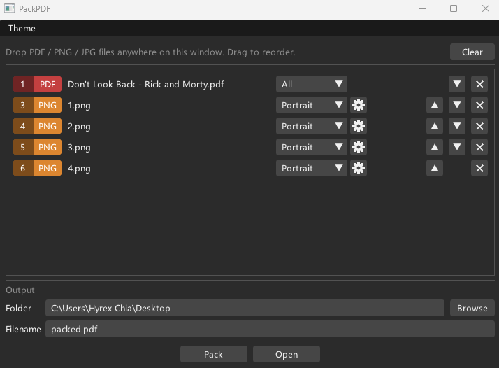

# PackPDF

**English** | [中文](README-cn.md)


<div align="center">



</div>

A Windows desktop tool that assembles PDFs as a timeline. Drop files onto the window, reorder rows, set per-row page ranges or image options, click Pack. Fully offline, with a CLI subcommand so AI agents can drive the exact same pipeline.

## What it solves

Existing tools all hit at least one of: upload required, paywalled, no timeline, or not scriptable.

<div align="center">

| Tool          | Offline    | Free      | Timeline  | Notes                              |
|---------------|------------|-----------|-----------|------------------------------------|
| Smallpdf      | ✗          | Limited   | ✗         | Uploads files, 2 tasks/day, 20-file cap |
| iLovePDF      | ✗          | Limited   | ✗         | Uploads files, 25-file cap         |
| PDFsam Basic  | ✓          | ✓         | ✗         | Per-file dialogs                   |
| PDF24 Creator | ✓          | ✓         | ✗         | Per-file dialogs                   |
| Stirling-PDF  | Self-hosted| ✓         | Partial   | Server architecture, not a desktop app |
| Adobe Acrobat | ✓          | ✗         | ✓         | Merge gated by subscription        |
| **PackPDF**   | **✓**      | **✓**     | **✓**     | Windows, no-install exe, agent-callable |

</div>

Typical case: `A.pdf{1-7}` → screenshot → `A.pdf{12-14}` → two landscape photos stacked on one A4. One screen, done.

## Who it's for

- **People who merge PDFs often.** If you assemble reports, scanned forms, or case materials every week, the per-file dialog model gets old fast. PackPDF treats the whole assembly as one editable list
- **People with sensitive files.** Anything you don't want to upload — contracts, medical records, financial statements, internal documents — has to stay local. Browser tools and SaaS uploaders are off the table by policy or by instinct. PackPDF never touches the network
- **People hitting paywalls.** Merging a few PDFs and pasting in a few screenshots is not a premium feature in any reasonable world, but several mainstream tools rate-limit or upsell it. PackPDF is just an exe
- **People who'd rather hand this to an AI agent.** You can ask an LLM to merge PDFs for you, but every round of "no, swap pages 5 and 6, drop page 12" burns context and time, and conversation can't precisely control ordering. The `pack-pdf compose` CLI is the agent-callable version of this pipeline: deterministic syntax, one command, no round-trips

## GUI usage

1. **Drop files onto the window.** PDFs, JPEGs, and PNGs are accepted. Each file becomes one row on the timeline, tagged with a colored badge (`PDF` / `JPG` / `PNG`)
2. **Reorder.** Use the up/down buttons on each row, or the X button to remove it. The output order is exactly the row order
3. **Set per-row options.**
   - PDF rows: choose `All`, `Range [a-b]`, or `Exclude [a-b]` for the page selection (1-indexed, inclusive)
   - Image rows: pick `Portrait` or `Landscape` inline; click the gear icon to open a popup with `Reverse 180°` (for head-down photos), `Padding` (0.5-inch white margin), `Scale` (`Fit page` default — small images upscale to fill A4; `Original size` keeps native pixel size with A4 surrounding it as natural margin), and `Auto Merge` (landscape only — stack two landscape images onto one A4 portrait sheet). The gear shows a small accent dot when any option is non-default
4. **Set output folder and filename.** Read and written in place at `<exe>/userdata/config.ini` (a baseline copy is checked into the repo and ships in every release zip)
5. **Click Pack.** When it succeeds, a notice appears with an `Open` button that opens the resulting file
6. **Theme menu** at the top: Photoshop Dark, Walnut, Monokai, ImGui Dark. Also persisted

The compose pass produces A4-portrait pages for images, caps oversized PDF pages to A4, and writes one output file via PDFium.

## CLI usage

The Pack button in the GUI just folds the timeline into a `pack-pdf compose ...` command and spawns this exe. Same binary, same engine — AI and scripts go through the exact same path the GUI does.

```
pack-pdf compose <token>... -o <output.pdf>
```

Each token describes one file plus options, in timeline order.

### Token syntax

<div align="center">

| Form | Meaning |
|---|---|
| `A.pdf` | All pages |
| `A.pdf{5}` | Page 5 |
| `A.pdf{1-7}` | Pages 1 through 7 (1-indexed, inclusive) |
| `A.pdf{!5}` | Exclude page 5 |
| `A.pdf{!1-3}` | Exclude pages 1 through 3 |
| `B.jpg` | Default portrait + fit |
| `B.jpg{landscape,merge}` | Landscape, auto-merge with the next landscape image |
| `C.png{orig,pad}` | Native size, add 0.5" white margin |
| `D.jpg{landscape,flip,merge,pad}` | Multiple options, comma-separated |

</div>

Image options:

<div align="center">

| Option | Default | Meaning |
|---|---|---|
| `portrait` / `landscape` | portrait | Rotation |
| `flip` | off | 180° flip for head-down photos |
| `fit` / `orig` | fit | fit upscales small images to fill A4; orig keeps native pixel size |
| `merge` | off | Stack with the next landscape image on one A4 sheet (landscape only) |
| `pad` | off | Add 0.5-inch white margin |

</div>

### Examples

```bat
:: First 7 pages of a report + a screenshot + pages 12-15 of the report
pack-pdf compose A.pdf{1-7} screenshot.png A.pdf{12-15} -o out.pdf

:: Two landscape photos stacked on one A4
pack-pdf compose left.jpg{landscape,merge} right.jpg{landscape} -o stacked.pdf

:: Quote tokens with {} in PowerShell
pack-pdf compose "A.pdf{1-7}" B.png -o out.pdf
```

### For AI agents

Fixed syntax, single call, stateless. No shell session state — the same command reproduces and diffs cleanly. `pack-pdf compose --help` prints the spec.

Exit codes: 0 success, 1 usage error, 2 token parse error, 3 compose error (file missing, PDFium failure, etc.).

## Build

### Prerequisites

- **Git**
- **Visual Studio 2026** with the C++ workload (the bundled CMake is used, no separate install needed). VS 2022 also works
- **vcpkg** at any path, exposed via the `VCPKG_ROOT` environment variable. One-time setup if you don't have one:
  ```bat
  git clone https://github.com/microsoft/vcpkg.git <path>\vcpkg
  <path>\vcpkg\bootstrap-vcpkg.bat -disableMetrics
  setx VCPKG_ROOT <path>\vcpkg
  ```

### First time / clean slate

Run `generate.bat` from a **Visual Studio Developer Command Prompt**. It deletes `.vs/`, `.vscode/`, `build/`, then runs `cmake --preset windows-x64`. Run it again any time you want a fresh build state.

### Visual Studio

`File` → `Open` → `Folder...` → select the repo root. Pick `pack-pdf.exe` in the startup-item dropdown, then **F5**. VS reads `CMakePresets.json` and manages the build out-of-tree under `build/windows-x64/`.

### Command line

```bat
cmake --build --preset debug
cmake --build --preset release
```

Executable: `build/windows-x64/bin/<Config>/pack-pdf.exe` (with `pdfium.dll` + `glfw3.dll` copied next to it).

### Output layout

All generated content lands under `build/` (gitignored, GNU-style), driven by `CMakePresets.json`:

```
build/
├── windows-x64/   # CMake cache + .vcxproj + bin/Debug/ + bin/Release/   (binaryDir)
├── fetched/       # ImGui sources + PDFium prebuilt                      (FETCHCONTENT_BASE_DIR)
└── vcpkg/         # vcpkg_installed                                      (VCPKG_INSTALLED_DIR)
```

`fetched/` and `vcpkg/` are siblings of the per-preset CMake dir, so wiping `build/windows-x64/` does not re-download PDFium (~10 MB) or reinstall vcpkg ports. To wipe everything: run `generate.bat` (or manually `rm -rf build/`).

### Source layout

Three role-based subdirectories:

```
src/
├── App/        # entry + GUI + CLI dispatch: main, AppMainWindow, AppTheme, AppUI, Cli
├── File/       # data model + PDFium engine + image cache: TimelineRow, Composer, ImageCache, FileTypes, ...
└── Selector/   # ImGui sub-widgets used inside timeline rows: PDFPageRangeSelector, ImageOptionsSelector
```

`#include` paths are rooted at `src/` (`#include "App/Cli.h"`); subdirectories reference each other explicitly so relative paths can't drift.

`TimelineRow = path + variant<PDFOptions, ImageOptions>` — PDF rows and image rows are split via the variant; selectors take the matching options type, so invalid combinations fail at compile time.

## Dependencies

- [Dear ImGui](https://github.com/ocornut/imgui) — UI (FetchContent, no install)
- [GLFW3](https://www.glfw.org/) — windowing (vcpkg)
- [PDFium](https://pdfium.googlesource.com/pdfium/) — PDF read / render / write, via [bblanchon/pdfium-binaries](https://github.com/bblanchon/pdfium-binaries) prebuilt (FetchContent, no source build)
- [stb_image](https://github.com/nothings/stb) — JPEG / PNG decode for image rows and hover previews

## Roadmap

- v0.1 — window, drag-drop ingest, timeline list, per-row PDF range / image options, compose pass for PDF + JPEG + PNG, output folder / filename, theme menu, config persistence
- v0.5 — `pack-pdf compose` CLI sharing one PDFium engine with the GUI; the GUI Pack button spawns this same exe and goes through the CLI path **(current)**
- v1.0 — portable zip release (pack-pdf.exe + pdfium.dll + glfw3.dll, unzip and run, no installer)

## License

[MIT](LICENSE). © 2026 Hyrex Chia.
